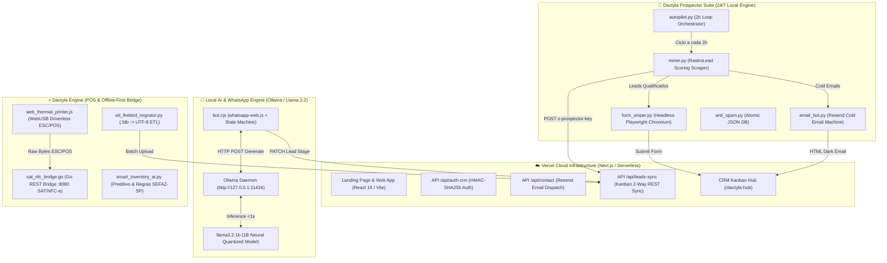

<div align="center">

# ⚡ DACTYLA CODE ECOSYSTEM
### *Enterprise Autonomous Prospecting Engine, High-Ticket CRM & Offline-First POS Architecture*

[](https://www.python.org/)
[](https://nodejs.org/)
[](https://react.dev/)
[](https://vercel.com/)
[](https://go.dev/)
[](https://ollama.com/)
[](https://tailwindcss.com/)
[](https://www.dactylacode.com.br)

<p align="center">
  <b>Plataforma de alta performance para Engenharia de Software B2B, Automação Comercial Omnichannel e Prospecção Autônoma 24/7.</b><br>
  Projetada especificamente para o mercado corporativo do Litoral Norte de São Paulo (Caraguatatuba, São Sebastião, Ubatuba e Ilhabela).
</p>

---

</div>

## 📐 Arquitetura do Sistema (System Topology)

O **Dactyla Code Ecosystem** combina uma infraestrutura Serverless global na nuvem Vercel com um conjunto de micro-agentes autônomos locais em Python/Node.js e uma IA conversacional executiva com inferência local em menos de 1 segundo.



---

## 🗂️ Estrutura de Diretórios (Directory Tree)

```text
c:\Users\Usuario\Desktop\Agencia de Tecnologia\
├── api/                             # Vercel Serverless Functions
│   ├── auth-crm.js                  # Login seguro HMAC-SHA256 com timingSafeEqual
│   ├── contact.js                   # Captura de briefing do site & Resend Email
│   └── leads-sync.js                # Sincronização 2-Way do CRM Kanban Cloud
│
├── dactyla_prospector/              # Suíte de Automação & Prospecção 24/7
│   ├── autopilot.py                 # Orquestrador contínuo a cada 2h + Relatório por E-mail
│   ├── miner.py                     # Scraper B2B com Inteligência RastroLead & Scoring
│   ├── form_sniper.py               # Disparador Headless Playwright em Formulários B2B
│   ├── email_bot.py                 # Máquina de Cold E-mail via Resend SDK
│   ├── bot.cjs                      # Atendimento WhatsApp 24/7 com IA Local Llama 3.2
│   ├── anti_spam.py                 # Banco de dados anti-duplicação com gravação atômica
│   ├── whatsapp_hub.py              # Construtor de links 1-clique & Exportador CSV
│   └── .env                         # Variáveis de ambiente locais (RESEND_API_KEY, etc.)
│
├── dactyla_engine/                  # Módulo Isolado de Automação Comercial & POS
│   ├── etl_firebird_migrator.py     # Migrador ETL assíncrono de bases .fdb (Firebird)
│   ├── web_thermal_printer.js       # SDK Driverless WebUSB / Web Serial API (ESC/POS)
│   ├── sat_nfc_bridge.go            # Microsserviço REST em Go (:8080) para SAT SEFAZ-SP
│   ├── smart_inventory_ai.py        # Motor Preditivo de Estoque & Auditoria Fiscal (CFOP/NCM)
│   └── README.md                    # Documentação do módulo de engenharia comercial
│
├── src/                             # Front-End React 19 + Vite
│   ├── components/
│   │   ├── DactylaHub.jsx           # CRM Kanban Executivo com indicador Autopilot 24/7
│   │   ├── BriefingModal.jsx        # Modal High-Ticket com botão direto para WhatsApp
│   │   ├── HeroSection.jsx          # Hero com mascote 3D Tamanduá Dactyla
│   │   └── ...                      # Demais componentes estilizados com Tailwind CSS
│   └── App.jsx                      # Roteador SPA (/dactyla-hub, /privacidade, /)
│
├── vercel.json                      # Configuração de Rewrites SPA para Vercel Edge
├── vite.config.js                   # Bundler de alta performance (Build em 5.4s)
└── package.json                     # Configurações do projeto Node.js
```

---

## 🛠️ Guia de Instalação e Execução (Developer Guide)

### 1. Pré-Requisitos do Sistema
- **Node.js** v20.0+ e **npm**
- **Python** 3.11+
- **Ollama** v0.33.2+ com o modelo `llama3.2:1b` baixado (`ollama pull llama3.2:1b`)
- **PM2** instalado globalmente (`npm install -g pm2`)

### 2. Configuração de Variáveis de Ambiente
Crie ou edite o arquivo `dactyla_prospector/.env`:

```env
PROSPECTOR_API_KEY=dactyla_prospector_secret_2026
CLOUD_SYNC_URL=https://www.dactylacode.com.br/api/leads-sync
OLLAMA_URL=http://127.0.0.1:11434/api/generate
RESEND_API_KEY=re_sua_chave_resend_aqui
RESEND_SENDER_EMAIL=onboarding@resend.dev
MY_NOTIFICATION_EMAIL=agenciadactylacode@gmail.com
```

### 3. Instalação de Dependências
```bash
# Dependências do Front-End e APIs
npm install

# Dependências da Suíte de Prospecção Python
pip install requests beautifulsoup4 duckduckgo_search playwright python-dotenv resend
playwright install chromium
```

### 4. Execução dos Processos 24/7 em Segundo Plano (PM2)

```powershell
# 1. Iniciar o Servidor de IA Local (Ollama)
start C:\Users\Usuario\AppData\Local\Programs\Ollama\ollama.exe serve

# 2. Iniciar a Suíte de Prospecção Autônoma
npx pm2 start dactyla_prospector/autopilot.py --name dactyla-prospector --interpreter python

# 3. Iniciar o Bot do WhatsApp com IA Llama 3.2
npx pm2 start dactyla_prospector/bot.cjs --name dactyla-bot

# 4. Iniciar a IA Preditiva de Estoque & Auditoria Fiscal
npx pm2 start dactyla_engine/smart_inventory_ai.py --name dactyla-ai --interpreter python

# 5. Salvar estado do PM2 para reinicialização automática no Windows
npx pm2 save
```

---

## 🔒 Segurança e Conformidade
- **CORS Estrito**: Restrição de origens permitidas (`https://www.dactylacode.com.br`).
- **Sanitização de XSS**: Tratamento de caracteres no payload via `escapeHTML`.
- **Zero Hardcoded Passwords**: Credenciais e chaves isoladas em variáveis de ambiente.
- **Conformidade SEFAZ-SP**: Assinatura criptográfica A1 e contingência física via SAT.

---

<div align="center">
  <b>Dactyla Code © 2026 — Engenharia de Software & Growth B2B de Alta Performance</b>
</div>
